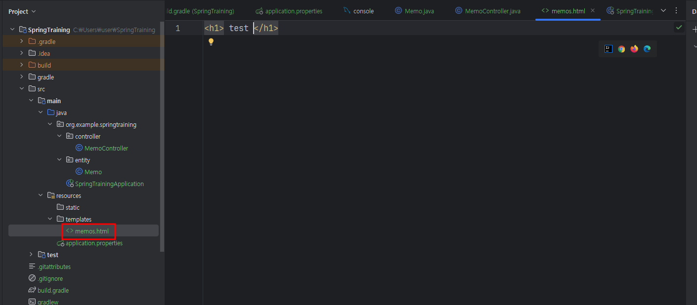

# RestController의 역할과 Reflection 코드에서 구현된 내용

## 목차
- [1. RestController의 역할](#1-restcontroller의-역할)
- [2. Reflection 코드에서 역할 구현](#2-reflection-코드에서-역할-구현)
    - [2-1. HTTP 요청 매핑](#2-1-http-요청-매핑)
    - [2-2. HTTP 요청 처리](#2-2-http-요청-처리)
    - [2-3. 데이터 반환](#2-3-데이터-반환)
- [3. Reflection 코드 흐름 요약](#3-reflection-코드-흐름-요약)
- [4. 초보 개발자를 위한 주의점](#4-초보-개발자를-위한-주의점)
- [5. 실제 코드에서의 한계와 대안](#5-실제-코드에서의-한계와-대안)

---

## 1. RestController의 역할

`@RestController`는 Spring에서 웹 요청을 처리하고 데이터를 반환하는 역할을 합니다.

- **HTTP 요청 매핑**: 특정 URL로 들어온 요청을 메서드에 매핑합니다.
- **데이터 반환**: JSON 또는 텍스트와 같은 데이터를 클라이언트로 반환합니다.
- **자동화된 처리**: 요청과 응답 처리를 자동화하여 개발자가 직접 핸들링할 필요가 없습니다.

---

## 2. Reflection 코드에서 역할 구현

### 2-1. HTTP 요청 매핑
Reflection 코드에서는 `@GetMapping` 애노테이션으로 요청 URL과 메서드를 매핑합니다.

```java
for (Method method : controllerClass.getDeclaredMethods()) {
        if (method.isAnnotationPresent(GetMapping.class)) {
GetMapping getMapping = method.getAnnotation(GetMapping.class);
String url = getMapping.value();
        urlToMethodMap.put(url, method); // URL과 메서드 매핑
        urlToInstanceMap.put(url, controllerInstance); // URL과 클래스 인스턴스 매핑
    }
            }
```


아래 코드는 Spring Boot를 연습하며 작동 요건을 알기 위해 내가 임의로 적은 코드이다.
무엇이 문제일까?

```java
@Controller
@RequestMapping("/memos") // Prefix
public class MemoController {

    @PostMapping
    public void createMemo() {
        System.out.println("hello");
    }
}
```

@Controller: Spring MVC에서 웹 요청을 처리하는 컨트롤러 클래스를 정의함.

@RequestMapping("/memos"): 이 컨트롤러가 /memos 경로로 들어오는 요청에 대해 응답함을 명시함.

@PostMapping: HTTP POST 요청을 처리하기 위한 메서드임. 현재는 메서드 내부에서 단순히 "hello"라는 문자열을 출력하는 로직만 있음.

### 오류 메시지 분석

**오류 메시지는 다음과 같음:**

org.thymeleaf.exceptions.TemplateInputException: Error resolving template [memos], template might not exist or might not be accessible by any of the configured Template Resolvers
이 오류는 Spring Boot 애플리케이션에서 Thymeleaf 템플릿 엔진이 memos라는 이름의 템플릿을 찾을 수 없음을 나타냄.

분석:
템플릿의 부재: 요청을 처리하는 메서드가 반환할 HTML 형식의 템플릿을 찾을 수 없는 경우임. Thymeleaf는 기본적으로 특정 경로(예: src/main/resources/templates)에서 템플릿 파일을 찾습니다. 따라서 /memos에 해당하는 템플릿 파일이 존재해야 함. 예를 들어, src/main/resources/templates/memos.html이 있어야 함.


HTTP 메서드: 현재 createMemo 메서드는 반환 타입이 void이며, HTTP POST 요청에 대해 아무런 응답을 하지 않음. Spring은 반환형이 void인 경우 뷰 이름을 memos로 해석하고 대응하는 템플릿을 찾으려 함. 따라서, 적절한 템플릿이 존재하지 않으면 오류가 발생함.


컨트롤러 주석: @RestController를 사용하면 JSON 형식의 응답을 반환하게 됨. 현재 @Controller를 사용하고 있기 때문에, HTML 템플릿을 반환하도록 설정되어 있음.


이에 따라 대응하는 html파일을 추가해 보았다.



결국 Spring Boot에서 통용되는 문법은 지금까지와는 다르다는 점을 확인할 수 있다.


https://docs.spring.io/spring-framework/reference/web/webmvc/mvc-servlet/viewresolver.html


